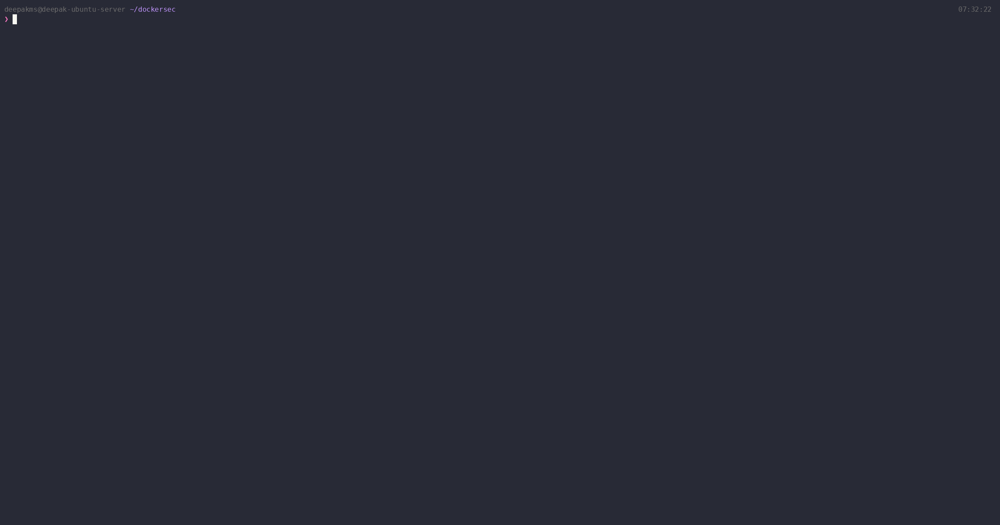

# dockersec



A fast, offline CLI tool that scans your Dockerfile and docker-compose.yml
for security vulnerabilities and bad practices.

Built for developers who want security feedback without leaving their terminal
or waiting for a cloud service.

---

## What It Catches

**Dockerfile**
- Containers running as root
- Secrets hardcoded in ENV instructions
- Base images using `latest` or unpinned tags
- Dangerous patterns like `curl | bash`
- Missing HEALTHCHECK, multi-stage builds, and more

**docker-compose**
- Privileged containers
- Docker socket mounts
- Host network mode
- Hardcoded secrets in environment blocks
- Missing resource limits
- SSH port exposed to host

---

## Install

### Linux / macOS (direct download)

```bash
# Linux
curl -sSL https://github.com/Deepak-coder80/dockersec/releases/latest/download/dockersec_linux_amd64 \
  -o dockersec && chmod +x dockersec && sudo mv dockersec /usr/local/bin/

# macOS (Intel)
curl -sSL https://github.com/Deepak-coder80/dockersec/releases/latest/download/dockersec_darwin_amd64 \
  -o dockersec && chmod +x dockersec && sudo mv dockersec /usr/local/bin/

# macOS (Apple Silicon)
curl -sSL https://github.com/Deepak-coder80/dockersec/releases/latest/download/dockersec_darwin_arm64 \
  -o dockersec && chmod +x dockersec && sudo mv dockersec /usr/local/bin/
```

### Windows

Download the latest `.exe` from the
[Releases page](https://github.com/Deepak-coder80/dockersec/releases)
and add it to your PATH.

### Build from Source

```bash
git clone https://github.com/Deepak-coder80/dockersec.git
cd dockersec
go build -o dockersec .
```

---

## Usage

```bash
# Scan a directory containing a Dockerfile or docker-compose.yml
dockersec scan .

# Scan a specific path
dockersec scan /path/to/project

# Table output
dockersec scan . --format table

# Check version
dockersec version
```

---

## GitHub Actions Integration

Add dockersec to your workflow to catch issues on every push and pull request.

```yaml
name: Docker Security Scan

on:
  push:
    branches: [main, dev]
  pull_request:
    branches: [main]

jobs:
  dockersec:
    runs-on: ubuntu-latest
    steps:
      - uses: actions/checkout@v4

      - name: Install dockersec
        run: |
          curl -sSL https://github.com/Deepak-coder80/dockersec/releases/latest/download/dockersec_linux_amd64 \
            -o dockersec && chmod +x dockersec && sudo mv dockersec /usr/local/bin/

      - name: Scan Dockerfile and docker-compose
        run: dockersec scan . --fail-on HIGH
```

---

## Adding Custom Rules

You do not need to write Go to add rules.
Create a YAML file in `rules/dockerfile/` or `rules/compose/`:

```yaml
id: CUSTOM001
type: dockerfile
severity: HIGH
description: |
  Explain the problem here.
fix: |
  Explain the fix here with an example.
match:
  instruction: RUN
  contains: "your pattern"
```

Run dockersec and your rule fires automatically. See [CONTRIBUTING.md](CONTRIBUTING.md)
for the full rule format and how to submit it upstream.

---

## Using with AI Tools

### Claude / ChatGPT

Paste your Dockerfile into the chat along with dockersec output.
Ask: "Explain these findings and help me fix them."

### Cursor / GitHub Copilot

Run dockersec in your terminal, copy the output, and paste it into
your AI assistant chat window. Ask it to apply the fixes directly.

### VS Code Task

Add this to `.vscode/tasks.json` to run dockersec on save:

```json
{
  "version": "2.0.0",
  "tasks": [
    {
      "label": "dockersec scan",
      "type": "shell",
      "command": "dockersec scan ${workspaceFolder}",
      "group": "build",
      "presentation": {
        "reveal": "always",
        "panel": "shared"
      }
    }
  ]
}
```

---

## Rule Coverage

| ID | Type | Severity | Check |
|---|---|---|---|
| DF001 | Dockerfile | HIGH | Container runs as root |
| DF002 | Dockerfile | HIGH | Base image uses latest tag |
| DF003 | Dockerfile | MEDIUM | ADD used instead of COPY |
| DF004 | Dockerfile | CRITICAL | Secret in ENV instruction |
| DF005 | Dockerfile | LOW | No HEALTHCHECK defined |
| DF006 | Dockerfile | CRITICAL | curl or wget piped to bash |
| DF007 | Dockerfile | LOW | apt-get without --no-install-recommends |
| DF008 | Dockerfile | LOW | Multiple RUN layers |
| DF009 | Dockerfile | MEDIUM | Privileged port exposed |
| DF010 | Dockerfile | MEDIUM | Image not pinned by digest |
| DF011 | Dockerfile | MEDIUM | No multi-stage build |
| DF012 | Dockerfile | LOW | COPY without --chown |
| DF013 | Dockerfile | LOW | apt cache not cleaned |
| DF014 | Dockerfile | LOW | No SHELL instruction |
| DF015 | Dockerfile | MEDIUM | npm install without --production |
| DF016 | Dockerfile | LOW | pip install without --no-cache-dir |
| DF017 | Dockerfile | MEDIUM | apt-get update and install in separate RUN |
| DF018 | Dockerfile | HIGH | sudo used in RUN |
| DF019 | Dockerfile | HIGH | chmod 777 used |
| DF020 | Dockerfile | MEDIUM | wget without checksum verification |
| DC001 | Compose | CRITICAL | privileged: true |
| DC002 | Compose | HIGH | Docker socket mounted |
| DC003 | Compose | HIGH | network_mode: host |
| DC004 | Compose | MEDIUM | No resource limits |
| DC005 | Compose | CRITICAL | Hardcoded secret in environment |
| DC006 | Compose | HIGH | Image uses latest tag |
| DC007 | Compose | HIGH | Port 22 exposed to host |
| DC008 | Compose | MEDIUM | restart: always without limits |

---

## Contributing

See [CONTRIBUTING.md](CONTRIBUTING.md) for how to add rules,
report bugs, and submit pull requests.

---

## License

MIT. See [LICENSE](LICENSE).
